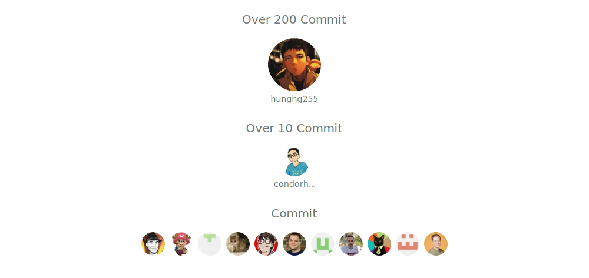

## Run Locally

Clone the project

```bash
git clone https://github.com/hunghg255/reactjs-tiptap-editor.git
```

Go to the project directory

```bash
cd reactjs-tiptap-editor
```

Install dependencies

```bash
pnpm install
```

Start the Demo server

```bash
npm run build:lib:dev
npm run playground
```

## All Contributors

Thanks to the following friends for their contributions to project:



## Star History


## Related

Here are some related projects

[Tiptap](https://tiptap.dev)

[Shadcn](https://ui.shadcn.com/)

[echo-editor](https://github.com/Seedsa/echo-editor)

## License

[MIT](./LICENSE)
